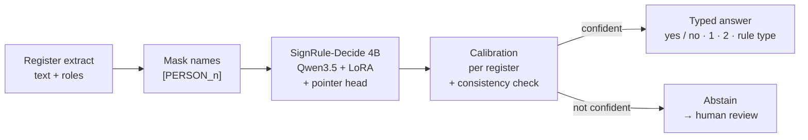

<div align="center">

# SignRule-Decide

### Who may sign for this company?

Typed, calibrated answers from official commercial-register extracts,<br>
computed on your own GPU: answering a request sends nothing anywhere.

[](LICENSE)
[](pyproject.toml)
[](https://huggingface.co/aildan/signrule-decide-4b)
[](https://doi.org/10.5281/zenodo.23224942)
[](https://doi.org/10.5281/zenodo.23224891)

[Quick start](#quick-start) · [Accuracy](#accuracy) · [How it works](#how-it-works) ·
[Limitations](#limitations-and-responsible-use) · [Model card](model_card.md) ·
[Paper](https://doi.org/10.5281/zenodo.23224942)

</div>

---

Every KYB onboarding has to answer one question: *who may bind this company?* For every managing
director, board member, partner and Prokurist, the Austrian Firmenbuch publishes the answer as
German free text, and nothing interprets it by machine. Today an analyst reads it by hand.

SignRule-Decide reads the register text and the registered roles. It returns a decision, not a
summary:

> **Geschäftsführer [PERSON_1]:** vertritt seit 01.03.2019 gemeinsam mit einem weiteren
> Geschäftsführer oder einem Prokuristen · *(same for [PERSON_2])* · **Prokurist [PERSON_3]:**
> Gesamtprokura gemeinsam mit einem Geschäftsführer

| Question | Answer | Confidence |
|---|---|---|
| Can one Geschäftsführer act alone? | **no** | 1.00 |
| Can two Geschäftsführer act together? | **yes** | 1.00 |
| Can a Geschäftsführer act with a Prokurist? | **yes** | 1.00 |
| Minimum number of signatures | **2** | 1.00 |
| Is the procuration joint (Gesamtprokura)? | **yes** | 1.00 |

When the model is not confident enough for the risk level you chose, it does not guess. It answers
`abstain: true` and the question goes to a person. More examples, in German:
[`results/demo/demo-de.md`](results/demo/demo-de.md).

## At a glance

<!-- table:headline -->
| Austria, 400 extracts never trained on | SignRule-Decide 4B |
|---|---|
| Office and coalition questions (15 yes/no, 2,178 answers) | 99.3 % |
| Minimum signers (389 extracts) | 97.7 % |
| Rule type (14 patterns) | 94.6 % |
| Dangerous errors ("can sign" when it cannot) | 0.6 % (12 of 2,178; 10 with confidence ≥ 0.9) |
| At a 2 % risk target | answers 99.9 %, observed risk 1.3 % |
<!-- /table -->

All numbers in this README are generated from [`results/`](results/) by `scripts/make_tables.py`.
The 400 Austrian extracts are a reference set: two different AI assistants answered each one
independently, only the answers they agree on are kept, and a person checked a sample. The numbers
measure agreement with that consensus, not with fully human labels
([details](#evaluation-data)). Minimum signers is the model's direct answer; derived from its own
coalition answers it reached 77.7 % on the first batch (a pre-registered criterion that was not
met).

## Why SignRule-Decide

| | |
|---|---|
| **Decisions, not text** | Every answer is a probability over fixed options: yes/no, a number of signers, a rule type. Nothing is generated, so the model cannot invent text. It can still be wrong with high confidence, which is why a person reviews binding decisions. |
| **Can stay silent** | Probabilities are calibrated per question type. At the risk level you choose (1, 2 or 5 %), the server abstains on questions it cannot answer within that risk. On Austria the fitted thresholds rarely trigger ([limitations](#limitations-and-responsible-use)). |
| **Private by design** | Names are never needed: callers pass roles and counts. Names sent anyway are removed and masked as `[PERSON_n]` in the text, and a text that still looks like it holds a name abstains. Everything runs on your own hardware. |
| **One model, many questions** | 15 office and coalition questions, the minimum number of signers, the rule type and procuration, all asked of one extract in one request. |
| **Several registers** | Austria and Norway are validated; Denmark is in beta. One question set and one API cover all three. |
| **Open** | Code, weights and every evaluation number are public under Apache-2.0. The included scripts re-fetch the data from the official registers. |

## How it works



- **Backbone:** `Qwen/Qwen3.5-4B-Base` (Apache-2.0) with a LoRA adapter and a
  [Kev](https://github.com/jaredpalmer/kev) pointer head. Each answer option is scored against the
  question, and a softmax over the options gives the answer.
- **Labels come from the registers.** Norway's register interprets its own signing rules and
  publishes rule codes. Austria's court codes each person's power as alone or joint. For joint
  powers, a hand-written, reviewed table of the register's standard wording names the partner.
  Training uses no synthetic examples and no labels produced by a language model.
- **One representation for every register:** alternatives (OR) of groups (AND) of offices. Every
  answer is derived from it.
- **Calibration:** one temperature per question type, plus Learn-then-Test thresholds per
  register, both fitted on validation data only. A register without its own thresholds gets the
  strictest combination, and the response says so (`jurisdiction_calibrated: false`). If no single
  signing rule could produce a combination of answers, those answers abstain.

## Quick start

**1. Install.** You need [uv](https://docs.astral.sh/uv/) and Python 3.12. The base model has
4.66 B parameters, so its 16-bit weights take about 9.3 GB of GPU or unified memory.

```bash
git clone https://github.com/aliildan/signrule-decide
cd signrule-decide
uv sync
```

On Linux this installs the CUDA 12.8 wheels (tested on an RTX 5090). On a Mac with Apple silicon it
installs PyPI torch (MPS) and mlx-lm instead, and the server uses Kev's MLX backend. The Mac path is
experimental: it has not yet been confirmed end to end, so please
[open an issue](https://github.com/aliildan/signrule-decide/issues) if it fails for you.

**2. Download the weights and start the server.**

```bash
uv run hf download aildan/signrule-decide-4b --local-dir runs/signrule-decide-4b
uv run python server/app.py --run runs/signrule-decide-4b \
  --policy NO=runs/signrule-decide-4b/calibration/NO.json \
  --policy AT=runs/signrule-decide-4b/calibration/AT.json
```

The server answers at `http://localhost:8300/v1/systemone`. `--device auto` is the default: CUDA, then Apple silicon, then CPU. The server prints the device
it picked. `--alpha` sets the risk level (default `0.02`).

**3. Ask.** Use the canonical wordings from `configs/questions.yaml`, because the calibration
belongs to those wordings:

```python
import httpx, yaml

questions = yaml.safe_load(open("configs/questions.yaml"))
ask = {q: questions[q] for q in ("ceo_alone", "ceo_with_prokurist", "min_signers")}
state = {
    "jurisdiction": "AT",
    "legal_form": "GmbH",
    "signature_rule": "Geschäftsführer [PERSON_1]: vertritt seit 01.03.2019 gemeinsam mit einem "
    "weiteren Geschäftsführer oder einem Prokuristen",
    "roles": [{"role": "Geschäftsführer", "count": 2}, {"role": "Prokurist", "count": 1}],
}
r = httpx.post("http://localhost:8300/v1/systemone", json={"state": state, "questions": ask})
for q, a in r.json()["answers"].items():
    print(q, a.get("noul", a.get("choice")), "abstain" if a["abstain"] else "")
```

Each answer carries either `noul` (the probability of "yes") or `choice` with `probabilities`. It
also carries `calibrated` (true for the canonical wordings) and `abstain`, with a reason when it
abstains. The API follows the System One schema (`/v1/systemone`), so existing Jev and Kev clients
work unchanged. To see the hand-written German examples against your own server, run
`uv run python scripts/demo.py --lang de`.

> **Ollama.** Ollama (v0.35+) serves its own decision models over the same `/v1/systemone` API
> ([list](https://ollama.com/search?c=decision)). It cannot load this checkpoint, which is in
> Kev's format, so use the server above.

## Accuracy

The 400 Austrian extracts are free-text extracts that no model was trained on:

<!-- table:at-gold -->
| Austria, reference set (400) | GF alone | Chair alone | Coalitions (15) | Min. signers | Rule type |
|---|---|---|---|---|---|
| **SignRule-Decide 4B** | 100.0 % | 100.0 % | 99.3 % | 97.7 % | 94.6 % |
| mmBERT-base, fine-tuned (1,024 tokens) | 100.0 % | 100.0 % | 98.8 % | 96.9 % | 94.3 % |
| XLM-R-large, fine-tuned (512 tokens) | 73.5 % | 95.8 % | 89.3 % | 63.5 % | 54.8 % |
| Phrase table (rules from the training labels) | 100.0 % | 100.0 % | 92.1 % | 80.2 % | 75.7 % |
| Keyword rules (selbständig / gemeinsam) | 100.0 % | 100.0 % | 59.1 % | 35.0 % | 11.1 % |

SignRule-Decide 4B on the same items: dangerous yes/no errors ("can sign" when the answer is "cannot") 12 of 2178 (0.6 %); at a 2 % risk target it answers 99.9 % of the questions with an observed risk of 1.3 %.
<!-- /table -->

**An honest comparison.** A small encoder (mmBERT-base, about 300M parameters) fine-tuned on the
same Austrian labels comes close on this set: the differences are a few answers per question
(about 3 of 389 on minimum signers) and were not tested for significance. The clearer difference
is that SignRule-Decide ranks its own confidence better (area under the risk–coverage curve 0.0052
against 0.0075), and abstention depends on that ranking. If you need only Austria and only these
questions, a fine-tuned encoder is a valid, cheaper choice.

### Supported registers

| Register | Status | Evidence |
|---|---|---|
| 🇦🇹 **Austria**: Firmenbuch | **Validated** | official court codes in training; reference set of 400 above |
| 🇳🇴 **Norway**: Brønnøysundregistrene | **Validated** | the register's own interpreter as training labels; 250 texts the interpreter could *not* read |
| 🇩🇰 **Denmark**: CVR | **Beta** (never trained on) | 300-item reference set, zero-shot; see limitations |
| Anything else | Untested | — |

<!-- table:other-registers -->
| Reference set | CEO alone | Coalitions | Min. signers | Rule type | In training? |
|---|---|---|---|---|---|
| Norway (250, beyond the interpreter) | 100.0 % | 99.0 % | 98.0 % | 93.0 % | trained |
| Denmark (300) | 89.2 % | 92.5 % | 86.4 % | 62.4 % | **never seen** |
<!-- /table -->

<details>
<summary><b>Hardest Austrian structures</b> (second reference batch)</summary>

<!-- table:at-structures -->
| Structure (second batch, 200) | Coalitions | Min. signers | Dangerous errors |
|---|---|---|---|
| Vorstand (AG, Genossenschaft, Privatstiftung) | 99.7 % | 99.1 % | 3 / 924 |
| Partnerships (OG, KG) | 97.7 % | 95.8 % | 3 / 176 |
| GmbH with several Geschäftsführer | 99.4 % | 100.0 % | 1 / 165 |
<!-- /table -->

</details>

<details>
<summary><b>Register-labelled test parts</b> (official codes as labels; wording shared with training, so near ceiling)</summary>

<!-- table:in-distribution -->
| Register-labelled test (codes / interpreter) | Coalitions | Min. signers | Rule type |
|---|---|---|---|
| Norway, held-out texts | 100.0 % | 99.7 % | 99.8 % |
| Austria, held-out patterns | 100.0 % | 100.0 % | 99.8 % |
| Austria, frozen pilot (2,500 companies) | 100.0 % | 100.0 % | 100.0 % |
<!-- /table -->

</details>

### Evaluation data

| Set | Labels | Size |
|---|---|---|
| Register-labelled test parts | official codes (Norway interpreter, Austrian court codes) | thousands of texts, see the tables |
| Reference sets (Austria, Norway, Denmark) | two different hosted AI assistants answered the masked extracts independently; kept where both agree; human spot checks | 400 / 250 / 300 extracts |

The two assistants agreed on almost every structural answer (Cohen's κ 0.98–1.00), so very few
extracts were dropped. Agreement this high can also hide blind spots the two assistants share.

The hypotheses and decision rules were written down before any result was read. Six of them were
not met and one only partly; all are published in the [model card](model_card.md). The project
owner chose the release model although its decision criterion (on the experimental ambiguity
score) was not met.

## Data and hardware

About a million official company registrations were read. Register texts repeat heavily, so they
reduce to about 31 thousand distinct training cases (text and roles).

<!-- table:data -->
| Register | Companies read | Kept | Unique | Train / val / test |
|---|---|---|---|---|
| Norway | 637,492 | 597,487 | 31,583 | 25,394 / 2,729 / 3,460 |
| Austria | 239,474 | 206,553 | 7,710 | 6,197 / 744 / 769 |
| Denmark | 143,646 | 143,311 | 14,147 | evaluation only |
| **Total** | **1,020,612** |  |  | **31,591** training cases |

Companies read: Norway with 1,274,984 API responses (signing and procuration); Austria company extracts. Unique = distinct (text, roles) groups; Austria: date-normalised patterns, plus a frozen pilot of 2,500 companies. Training: 2 epochs, 37.7 M tokens.
<!-- /table -->

Training and serving ran on one consumer GPU, with no cloud:

<!-- table:compute -->
| Compute | Value |
|---|---|
| GPU | 1 × NVIDIA GeForce RTX 5090 (31.8 GB) |
| CPU / RAM | Intel(R) Core(TM) i9-14900KF / 92 GB |
| Training (LoRA, bf16) | 14.6 h, peak GPU memory 20.2 GB, 7,836 optimizer steps |
| Serving (one request, 8.5 questions) | p50 160 ms, p95 175 ms, 6.7 requests/s |
<!-- /table -->

The serving latency was measured with an earlier checkpoint of the same 4B architecture.

## Limitations and responsible use

- **Not legal advice.** A register can be out of date, and articles of association can grant
  powers that the register text does not show. Keep a person in the loop for every binding
  decision.
- **Per-person powers:** sometimes holders of one office have different powers. The office-level
  question ("can a managing director act alone?") is then open by our convention, and the model
  tends to answer "yes" if any holder may act alone.
- **Partnerships** (OG/KG) are the weakest Austrian structure.
- **Abstention rarely triggers on Austria.** The Austrian validation part is mostly standard
  wording, so the fitted thresholds sit at their lowest level and the server answers 99.9 % of the
  questions. 10 of the 12 dangerous errors came with a confidence of 0.9 or more, where no threshold
  would catch them.
- **Denmark (beta):** the model often reads *"direktionen"* as a collective body. The abstention
  thresholds do not transfer to a register the model has never seen: at a 5 % risk target the
  observed risk was 14.3 %.
- The **ambiguity** score is experimental and is never served as a decision.
- No evaluation subset has been **fully verified by a person**. The hard-case numbers measure
  agreement with the consensus of two AI assistants, spot-checked by a person.

## Reproduce

The data is public, but this repository does not redistribute it. The scripts fetch it from the
official sources, rate-limited and cached, with a descriptive User-Agent:

| Register | Source | Licence | Script |
|---|---|---|---|
| Norway | Brønnøysundregistrene, Enhetsregisteret + Fullmakttjenesten | NLOD | `python -m signrule.ingest.ingest_no` |
| Austria | Firmenbuch HVD via JustizOnline (API key) | CC BY 4.0 | `python -m signrule.ingest.ingest_at` |
| Denmark | CVR system-til-system (user account) | Danish public-data terms | `python -m signrule.ingest.ingest_dk` |

<details>
<summary><b>Pipeline commands</b></summary>

```bash
make data && make data-check
python -m signrule.normalize.pipeline_at run && python -m signrule.normalize.pipeline_at check
python -m signrule.train.kev_wrapper train --config configs/train/4b-noat-v2.yaml
python -m signrule.train.kev_wrapper bench --run runs/<name> --jurisdiction <j> --split <s> --part <p> --raw
python eval/run_all.py --jurisdiction <j> --split random
```

`make data` builds the Norwegian data; training takes about 15 h on one RTX 5090.

</details>

The reference sets contain register texts and are not published. Their agreement statistics are in
`results/gold/`.

## Citation

If you use SignRule-Decide, please cite the paper:

```bibtex
@misc{ildan2026whomaysign,
  author    = {Ildan, Ali},
  title     = {Who May Sign? Typed, Calibrated Decisions on Company Representation Rules in the Austrian Commercial Register},
  year      = {2026},
  publisher = {Zenodo},
  note      = {Preprint},
  doi       = {10.5281/zenodo.23224942},
  url       = {https://doi.org/10.5281/zenodo.23224942}
}
```

<details>
<summary>The code and model (software citation)</summary>

```bibtex
@software{ildan2026signrule,
  author    = {Ildan, Ali},
  title     = {SignRule-Decide: typed, calibrated decisions on company representation rules},
  year      = {2026},
  publisher = {Zenodo},
  doi       = {10.5281/zenodo.23224891},
  url       = {https://github.com/aliildan/signrule-decide}
}
```

</details>

## Licence and attribution

Code and model weights are licensed under Apache-2.0. This project contains data from:

- Brønnøysundregistrene (NLOD)
- Firmenbuch – Bundesministerium für Justiz / JustizOnline (HVD), CC BY 4.0
- Det Centrale Virksomhedsregister (CVR), Erhvervsstyrelsen: "Indeholder data, som benyttes i
  henhold til vilkår for brug af danske offentlige data"

No register data is redistributed. The project was built with the help of an AI coding assistant.
